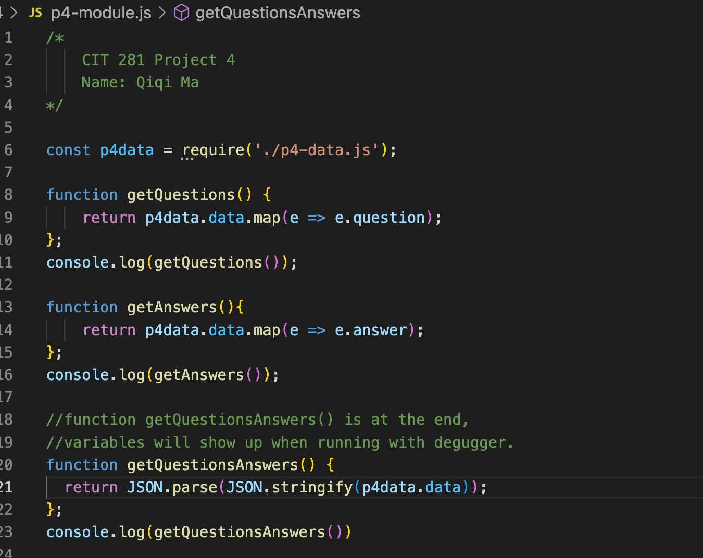
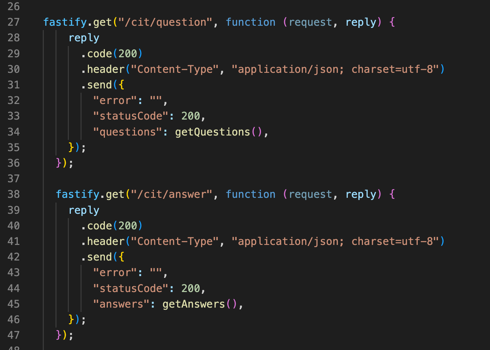

# cit281-project-4
[cit281-project-4](https://github.com/UO-CIT-qiqima/cit281-project-4)

Project 4:
1. I create a REST API that works with a "data" source of questions and answers. 
2. I also create a Node.js REST API to handle the GET verb. 
3. I learn to use REST API to handle the POST verb and PUT verb.

